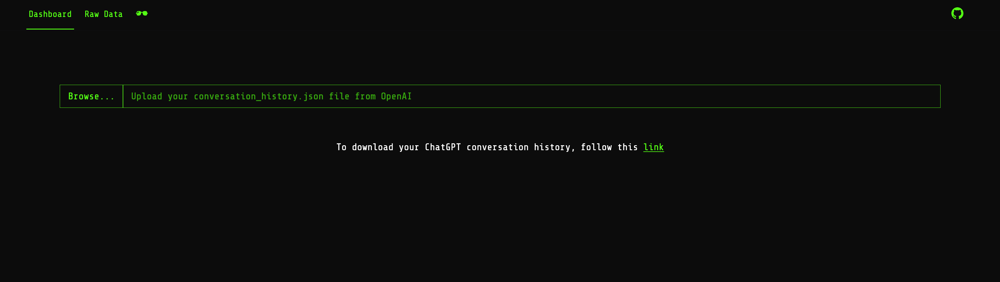
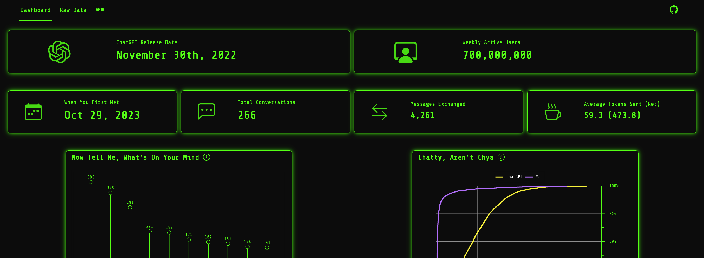

# ChatGPT Conversation History Explorer    

## Key Features
- Dive deeper into your data with interactive plots and card visuals.
- Discover your usage habits with key statistics, including the total number of conversations, messages sent, and your most active day of the week.
- A fun quiz tests your knowledge of AI and your own usage patterns.
- Get some inspiration by listening to the Matrix (1999) soundtrack.
- Download a formatted copy of your conversation history straight to CSV.

## How to Use
- Download your conversation history from OpenAI [here](https://help.openai.com/en/articles/7260999-how-do-i-export-my-chatgpt-history-and-data).
- Once downloaded, unzip the folder, find the conversation history `.json` file and upload it to the dashboard.

## Technical Details
- Built with `shiny`, and `bslib`.
- Interactive plots powered by `ggiraph`.
- Minimalist CSS for a matrix inspired aesthetic.

## Data Privacy
- All data processing is done locally within the app; your data is never stored or sent to a remote server.
